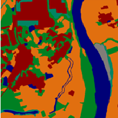

<h1 align="center">
  <div style="display: flex; justify-content: center; align-items: center;">
    
    
  </div>
  <br/>superlabel
</h1>

<h4 align="center">
  地表覆盖数据高效生产软件
</h4>

<div align="center">
  <a href="#功能特性"><b>功能特性</b></a>
  | <a href="#使用"><b>使用</b></a>
</div>

<!-- <div align="center">
  
</div> -->

## 概述

这是基于Labelme的二次开发版本，由中南大学团队进行适配优化，以更好地满足地表覆盖数据生产及其相关算法实现的需求。

Labelme 是一个受 http://labelme.csail.mit.edu 启发而开发的图形化图像标注工具。

它使用 Python 编写，并采用 Qt 实现图形界面。

## 功能特性

- 保持原始标注功能。
- 多边形按照标签整体选择与取消显示。
- 依据置信度图对图斑进行逐个编辑功能。
- 周围影像显示功能。
- 文本提示显示功能。
- 错分图斑提示功能。
- 语义底图自动生成功能。（已使用labelme版实现）

## 使用

### Windows

首先安装 [Anaconda](https://www.continuum.io/downloads), 然后在anaconda命令行运行:

```bash
conda create --name=superlabel python=3.9
conda activate superlabel
pip install -e .

# 或者从以下地址下载编译好的exe文件:
# https://github.com/gethin241/superlabel/releases
```
