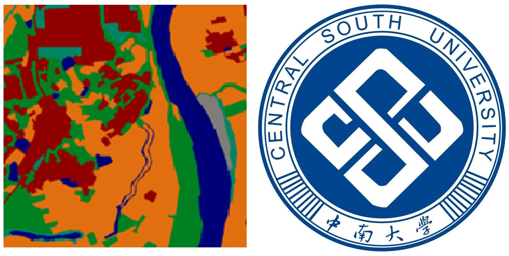

<h1 align="center">
  
  <br/>superlabel
</h1>

<h4 align="center">
  地表覆盖数据高效生产软件
</h4>

<div align="center">
  <a href="#功能特性"><b>功能特性</b></a>
  | <a href="#使用"><b>使用</b></a>
</div>


## 概述

这是基于Labelme的二次开发版本，由中南大学团队进行适配优化，以更好地满足地表覆盖数据生产及其相关算法实现的需求。

Labelme 是一个受 http://labelme.csail.mit.edu 启发而开发的图形化图像标注工具。

它使用 Python 编写，并采用 Qt 实现图形界面。

## 功能特性

- 保持原始标注功能。
- 多边形按照标签整体选择与取消显示。
- 依据置信度图对图斑进行逐个编辑功能。
- 周围影像显示功能。
- 文本提示显示功能。
- 错分图斑提示功能。
- 语义底图自动生成功能。（已使用labelme版实现）

## 使用

### Windows

1. **安装 Anaconda**

   首先下载并安装 [Anaconda](https://www.continuum.io/downloads)（推荐 Python 3.x 版本）。

2. **打开 Anaconda Prompt**

   在开始菜单中找到并运行 `Anaconda Prompt`。

3. **从 GitHub 拉取项目代码**

   ```bash
   git clone https://github.com/gethin241/superlabel.git
   cd superlabel

4. **创建虚拟环境**

   ```bash
   conda create --name=superlabel python=3.9
   conda activate superlabel
   
5. **安装依赖并运行**

   ```bash
   pip install -e .
   labelme
   
  **可选：下载编译好的 exe 文件**
从以下地址下载编译好的exe文件:
https://github.com/gethin241/superlabel/releases
